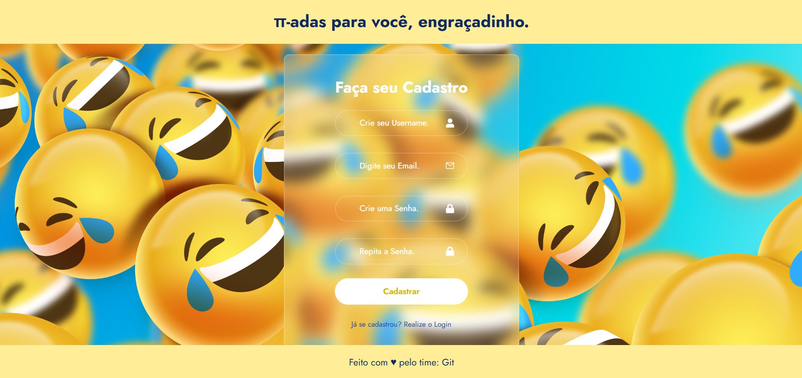
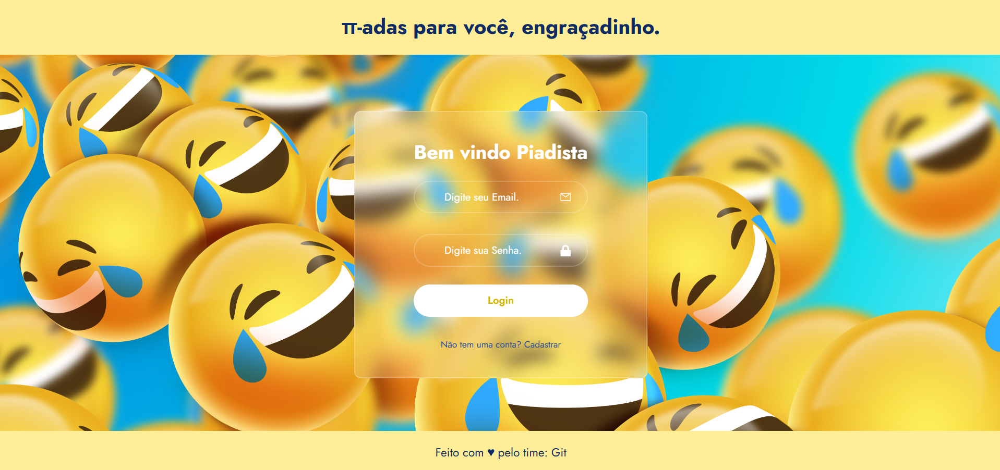
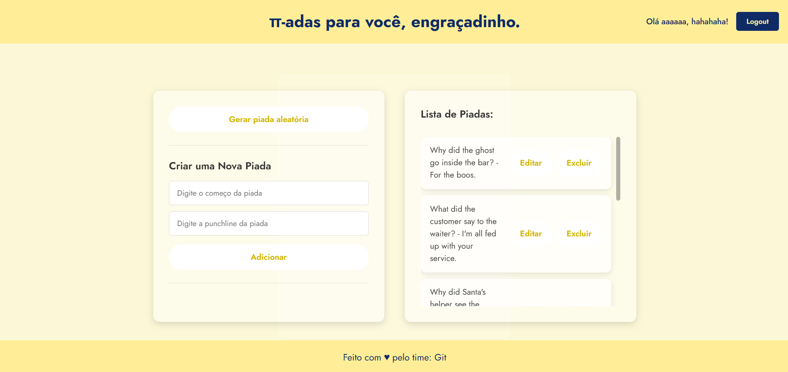
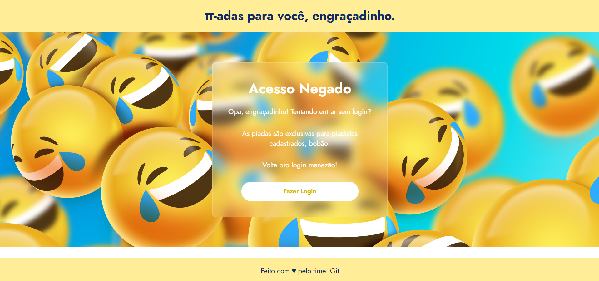
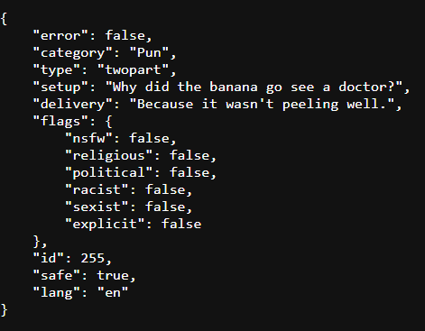

# Projeto pi-ada

O Site pi-ada foi feito para o armazenamento de piadas para serem usadas em todas as ocasiões possiveis, desde o Natal até quando está se sendo stalkeado na rua, para que voce sempre esteja preparado para soltar uma boa piada para aliviar o clima, bem como a chance de, no caso de falta de ideias, o gerar de uma piada aleatória vinda direto do banco de dados da https://v2.jokeapi.dev/joke/

Abaixo segue as tecnologias de cada parte do projeto, bem como fazer cada parte funcionar:

# Frontend

disponivel no link : https://github.com/PedroLopes-28/Frontend-pi-ada

O Front-end do projeto foi feito usando o React como framework e JavaScript como linguagem de programação, bem como CSS para estilização e Axios para integração com o Backend que será descrito mais adiante, alem de autenticação por token JWT retornado do back e armazenado via LocalStorage.

O Front conta com três paginas:

A pagina de cadastro para a criação da conta, que é onde suas piadas serão armazenadas, segue imagem da pagina abaixo:

  

A pagina de login para que voce entre em sua conta, é por aqui que o Backend envia o JWT Token para a autenticação do usuário, permitindo acesso a proxima pagina de piadas, bem como permite que o Front acesse as rotas autenticadas do Backend, que são as de criação de piadas. Segue imagem da pagina abaixo:

A pagina de Piadas (Home) conta com um formulario para a criação das suas encarnações da diversão bem como possibilita a geração de piadas aleatorias pelo botão acima dele, as piadas são armazenadas no Backend e então devolvidas na lista a direita, cada piada pode ser deletada ou editada como o usuário preferir. Segue imagem da pagina abaixo:

Alem dessas paginas no caso de tentativa de entrada por link (colocando o /home na url sem fazer login)
o usuário não autorizado será redirecionado para a pagina abaixo:

# Backend

disponivel no link : https://github.com/PedroLopes-28/Backend-pi-ada

O Backend do projeto foi feito usando o Express.Js como framework, Typescript como linguagem de programação e para o armazenamento no banco de dados do tipo SQLite, foi usado o Prisma e o PrismaClient para manipulação do banco de dados.

O Backend conta com 7 rotas no total, sendo duas para o usuário, sendo a de Login e de Cadastro e as outras 5 Para as piadas, sendo:

- Pegar todas as piadas de um usuário
- Criar uma nova piada
- Editar uma piada
- Remover uma piada
- Pegar uma piada aleatória da api pelo link https://v2.jokeapi.dev/joke/Any?lang=en&safemode&type=twopart

Alem disso, é possivel editar o link da api citada acima para modificar os tipos de piada que vem por ela, segue o modelo de piada padrão que a api retorna:

Com isso é possivel filtrar por category, como por exemplo category=programming para piadas de programação dentre outras bem como garantir que as suas piadas não vão ofender ninguem, no caso do projeto usamos o safe-mode no link, que já filtra piadas ofensivas. Bem como o idioma das piadas que irão vir por meio de lang="" que no caso desse projeto optamos por inglês (en) devido a maior variedade de piadas

É possivel filtrar apenas tags especificas ao trocar o safemode por blacklistFlags="" e colocar as flags que voce deseja remover no lugar das aspas.

# Equipe de desenvolvimento

Todo esse projeto foi desenvolvido por nós aqui em baixo:

- Pedro Henrique de Souza Lopes - https://github.com/PedroLopes-28
- Bianca dos Reis Moraes - https://github.com/BiancaReisMoraes
- Silvan da José da Silva Júnior - https://github.com/SilvanJr14